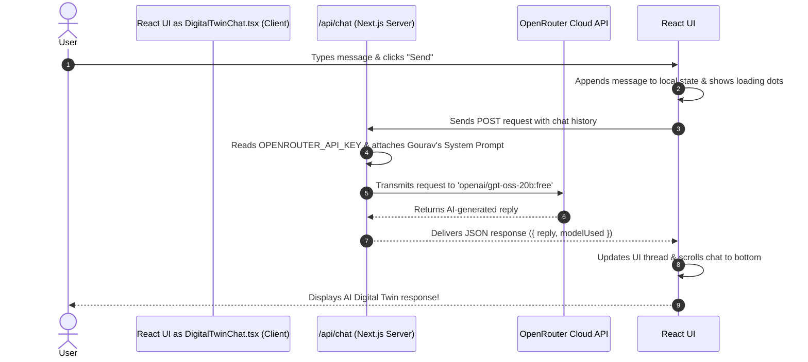

# Beginner's Guide: Building an AI "Digital Twin" Chat Widget with Next.js & OpenRouter

Welcome! If you are a beginner in frontend web development, this tutorial will guide you step-by-step through how we created an **AI Digital Twin Chatbot** for Gourav Kar's portfolio website.

By the end of this guide, you will understand how modern React components, API routes, CSS styling, and Artificial Intelligence (AI) models work together to create an interactive chat experience!

---

## 📚 Table of Contents
1. [Summary of Technologies Used](#1-summary-of-technologies-used)
2. [High-Level Architectural Walkthrough](#2-high-level-architectural-walkthrough)
3. [Step-by-Step Code Review & Code Samples](#3-step-by-step-code-review--code-samples)
   - [Step 1: Environment Variables (`.env`)](#step-1-environment-variables-env)
   - [Step 2: Server-side API Route (`src/app/api/chat/route.ts`)](#step-2-server-side-api-route-srcappapichatroutets)
   - [Step 3: Client-side UI Component (`src/components/DigitalTwinChat.tsx`)](#step-3-client-side-ui-component-srccomponentsdigitaltwinchattsex)
   - [Step 4: Connecting the Component (`Navbar.tsx` & `page.tsx`)](#step-4-connecting-the-component-navbartsx--pagetsx)
4. [5 Key Suggestions for Future Code Improvements](#4-5-key-suggestions-for-future-code-improvements)

---

## 1. Summary of Technologies Used

Before diving into code, let's break down the main building blocks:

- **Next.js (App Router v16)**: A popular framework built on top of React. It handles both the frontend (user interface) and the backend (API endpoints) in a single unified codebase.
- **React 19 & React Hooks (`useState`, `useRef`, `useEffect`)**: React lets us build user interfaces out of reusable "components". Hooks allow our components to remember data (state) and react to changes.
- **TypeScript**: A version of JavaScript with types. It helps prevent bugs by ensuring functions receive the right kinds of data (e.g., numbers, strings, or arrays).
- **Tailwind CSS**: A utility-first CSS framework that lets us style components directly inside HTML/React tags (e.g., `bg-slate-900`, `text-cyan-400`, `rounded-xl`).
- **OpenRouter API (`openai/gpt-oss-20b:free`)**: A unified API platform that provides access to Large Language Models (LLMs). We use the `openai/gpt-oss-20b:free` model to generate intelligent responses.
- **Environment Variables (`.env`)**: A secret configuration file stored on the server so sensitive keys (like API secret keys) are never exposed to public website visitors.

---

## 2. High-Level Architectural Walkthrough

How does a message travel from the user's screen to the AI and back? Here is the complete flow:



---

## 3. Step-by-Step Code Review & Code Samples

### Step 1: Environment Variables (`.env`)

Never hardcode secret API keys directly into public JavaScript files! We store secret keys inside a `.env` file at the root of the project:

```env
OPENROUTER_API_KEY=
```

---

### Step 2: Server-side API Route (`src/app/api/chat/route.ts`)

In Next.js, files named `route.ts` inside `src/app/api/` act as backend server endpoints.

#### 💡 Key Concepts:
1. **System Prompt**: A detailed set of instructions sent to the AI model before the user's message. It instructs the AI to pretend to be Gourav Kar's Digital Twin and provides Gourav's background knowledge (projects, skills, education).
2. **`POST` Handler**: Receives the chat history sent from the frontend browser.
3. **`fetch()` to OpenRouter**: Makes a secure HTTP request using the secret `OPENROUTER_API_KEY`.

#### 💻 Code Breakdown:

```typescript
import { NextRequest, NextResponse } from "next/server";

// 1. SYSTEM PROMPT: Gives the AI model identity & knowledge
const SYSTEM_PROMPT = `You are the Digital Twin AI assistant of Gourav Kar, a Java Backend & Machine Learning Engineer.
Your purpose is to answer questions about Gourav's experience, technical skills, projects, and education.

[NAME & TITLE]
- Name: Gourav Kar
- Role: Java Backend & ML Engineer
- Status: Available for full-time backend and software engineering roles
- Email: gouravkar0072@gmail.com
- Phone: +91-8016105008

[KEY PROJECTS]
- AI Maternal Health & Preeclampsia Risk System (Dual-stage ML + Gemini API)
- Garment Industry ERP Portal (Spring Boot, SQL Server)
- A2Z Fast Food Terminal Platform (FastAPI, Python)
`;

export async function POST(req: NextRequest) {
  try {
    const { messages, model } = await req.json();

    // Read API key safely from environment
    const apiKey = process.env.OPENROUTER_API_KEY?.trim();
    if (!apiKey) {
      return NextResponse.json(
        { error: "API key is missing" },
        { status: 500 }
      );
    }

    const targetModel = model || "openai/gpt-oss-20b:free";

    // Combine system prompt with user messages
    const payloadMessages = [
      { role: "system", content: SYSTEM_PROMPT },
      ...messages,
    ];

    // Call OpenRouter API
    const response = await fetch("https://openrouter.ai/api/v1/chat/completions", {
      method: "POST",
      headers: {
        Authorization: `Bearer ${apiKey}`,
        "Content-Type": "application/json",
      },
      body: JSON.stringify({
        model: targetModel,
        messages: payloadMessages,
        temperature: 0.7,
      }),
    });

    const data = await response.json();
    const assistantReply = data.choices?.[0]?.message?.content || "Hello!";

    return NextResponse.json({
      reply: assistantReply,
      modelUsed: targetModel,
    });
  } catch (err: any) {
    return NextResponse.json({ error: err.message }, { status: 500 });
  }
}
```

---

### Step 3: Client-side UI Component (`src/components/DigitalTwinChat.tsx`)

This component controls the visual chat drawer on the web page.

#### 💡 Key Concepts:
1. **`"use client"` Directive**: Tells Next.js that this component runs in the user's browser (allowing click events, input typing, and state changes).
2. **`useState`**: Tracks component state (whether drawer is open, messages list, current user input, loading status).
3. **`useRef` & `useEffect`**: Auto-scrolls the conversation box to the bottom whenever a new message arrives.

#### 💻 Code Breakdown:

```tsx
"use client";

import React, { useState, useRef, useEffect } from "react";
import { Bot, User, Send, X, RefreshCw } from "lucide-react";

interface Message {
  id: string;
  role: "user" | "assistant";
  content: string;
  timestamp: string;
}

export const DigitalTwinChat: React.FC = () => {
  const [isOpen, setIsOpen] = useState(false);
  const [inputMessage, setInputMessage] = useState("");
  const [loading, setLoading] = useState(false);
  const [messages, setMessages] = useState<Message[]>([
    {
      id: "welcome",
      role: "assistant",
      content: "👋 Hello! I am Gourav Kar's Digital Twin. Ask me anything!",
      timestamp: "Just now",
    },
  ]);

  const chatContainerRef = useRef<HTMLDivElement>(null);

  // Auto-scroll effect
  useEffect(() => {
    if (chatContainerRef.current) {
      chatContainerRef.current.scrollTop = chatContainerRef.current.scrollHeight;
    }
  }, [messages, loading]);

  // Function to send message to backend API
  const handleSendMessage = async (customText?: string) => {
    const text = (customText || inputMessage).trim();
    if (!text || loading) return;

    const userMsg: Message = {
      id: `user-${Date.now()}`,
      role: "user",
      content: text,
      timestamp: new Date().toLocaleTimeString([], { hour: "2-digit", minute: "2-digit" }),
    };

    setMessages((prev) => [...prev, userMsg]);
    setInputMessage("");
    setLoading(true);

    try {
      const res = await fetch("/api/chat", {
        method: "POST",
        headers: { "Content-Type": "application/json" },
        body: JSON.stringify({
          messages: [...messages, userMsg].map((m) => ({
            role: m.role,
            content: m.content,
          })),
        }),
      });

      const data = await res.json();

      const botMsg: Message = {
        id: `bot-${Date.now()}`,
        role: "assistant",
        content: data.reply,
        timestamp: new Date().toLocaleTimeString([], { hour: "2-digit", minute: "2-digit" }),
      };

      setMessages((prev) => [...prev, botMsg]);
    } catch (err) {
      console.error(err);
    } finally {
      setLoading(false);
    }
  };

  return (
    <>
      {/* Floating Action Button */}
      <button
        onClick={() => setIsOpen(!isOpen)}
        className="fixed bottom-6 right-6 z-50 p-4 rounded-2xl bg-cyan-500 text-slate-950 font-bold shadow-lg"
      >
        {isOpen ? <X /> : <Bot />}
      </button>

      {/* Chat Window */}
      {isOpen && (
        <div className="fixed bottom-24 right-6 w-[400px] h-[550px] bg-slate-950 border border-slate-800 rounded-2xl shadow-2xl flex flex-col z-50">
          {/* Header */}
          <div className="p-4 bg-slate-900 border-b border-slate-800 flex justify-between items-center text-white">
            <div className="flex items-center gap-2">
              <Bot className="text-cyan-400" />
              <span className="font-bold">Gourav Kar — AI Twin</span>
            </div>
          </div>

          {/* Messages Stream */}
          <div ref={chatContainerRef} className="flex-1 p-4 overflow-y-auto space-y-3">
            {messages.map((m) => (
              <div key={m.id} className={`flex ${m.role === "user" ? "justify-end" : "justify-start"}`}>
                <div className={`p-3 rounded-xl max-w-[80%] text-xs ${m.role === "user" ? "bg-cyan-500/20 text-cyan-200" : "bg-slate-900 text-slate-200"}`}>
                  {m.content}
                </div>
              </div>
            ))}
            {loading && <div className="text-slate-500 text-xs">Thinking...</div>}
          </div>

          {/* Input Box */}
          <form onSubmit={(e) => { e.preventDefault(); handleSendMessage(); }} className="p-3 border-t border-slate-800 flex gap-2">
            <input
              type="text"
              value={inputMessage}
              onChange={(e) => setInputMessage(e.target.value)}
              placeholder="Ask a question..."
              className="flex-1 bg-slate-900 border border-slate-800 rounded-xl px-3 py-2 text-xs text-white"
            />
            <button type="submit" className="p-2 bg-cyan-500 text-slate-950 rounded-xl">
              <Send className="w-4 h-4" />
            </button>
          </form>
        </div>
      )}
    </>
  );
};
```

---

### Step 4: Connecting the Component (`Navbar.tsx` & `page.tsx`)

To make the AI Twin accessible from the top navigation bar as well as the floating bottom-right button, we passed state handlers between components in `page.tsx`:

```tsx
// src/app/page.tsx
export default function Home() {
  const [isChatOpen, setIsChatOpen] = useState(false);

  return (
    <main>
      <Navbar onOpenChat={() => setIsChatOpen(true)} />
      {/* ... Other sections ... */}
      <DigitalTwinChat isOpen={isChatOpen} onClose={() => setIsChatOpen(false)} />
    </main>
  );
}
```

---

## 4. 5 Key Suggestions for Future Code Improvements

While the current implementation is fully functional and production-ready, here are **5 great ways to enhance the code** in future iterations:

1. **Implement Response Streaming (Typewriter Effect)**:
   - *Current*: The user waits for the entire response to complete before seeing any text.
   - *Improvement*: Use Server-Sent Events (SSE) or Next.js streaming API to stream tokens in real-time as the AI generates them word-by-word.

2. **Persist Chat History in `localStorage`**:
   - *Current*: Refreshing the browser page clears the chat conversation.
   - *Improvement*: Store messages in browser `localStorage` so visitors can navigate away and return without losing their conversation context.

3. **Rich Markdown Formatting (`react-markdown`)**:
   - *Current*: Plain text rendering.
   - *Improvement*: Integrate `react-markdown` and `syntax-highlighter` so bullet points, bold text, link buttons, and code blocks render formatted HTML.

4. **Rate Limiting & Abuse Protection**:
   - *Current*: Direct endpoint access without IP limit check.
   - *Improvement*: Implement an in-memory or Redis rate-limiter (e.g., using `@upstash/ratelimit`) to restrict visitors to 10 queries per minute to protect API quota.

5. **Enhanced Accessibility (ARIA Tags)**:
   - *Current*: Basic modal visibility state.
   - *Improvement*: Add proper `aria-expanded`, `aria-live="polite"` region for dynamic messages, and `tabIndex` focus trapping for keyboard navigation compliance.

---

### 🎉 Conclusion
You now have a solid understanding of how to connect modern frontend React components with server-side API routes and AI cloud services! Feel free to refer to this tutorial whenever you want to build similar interactive tools.
